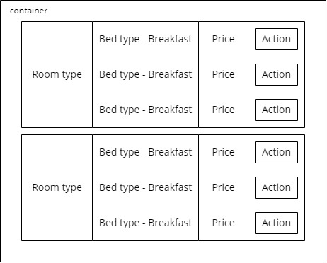

Sample hotel booking site frontend built with GatsbyJS V2 and React.
Codebase migrated from GatsbyJS V1 to GatsbyJS V2.

Stacks Used:
- Gatsby V1, a static site generator with React frontend https://www.gatsbyjs.org/
- Bulma CSS framework https://bulma.io/
- Bloomer React Components for Bulma https://bloomer.js.org

Demo at https://demo-transylvania.surge.sh/

## 🚀 How to test in your local environment

1.  **Start developing.**

    ```shell
    npm install
    gatsby develop
    ```

2.  **Open the source code and start editing!**

    Your site is now running at `http://localhost:8000`!

## Technical Details
1. We extract from the JSON input the infos for room type, bed type, price etc.
2. Phew, fortunately not much changes in the codebase when upgrading to GatsbyJS V2 from V1, only problem being the npm install no longer works properly due to old packages

## Rough Design

